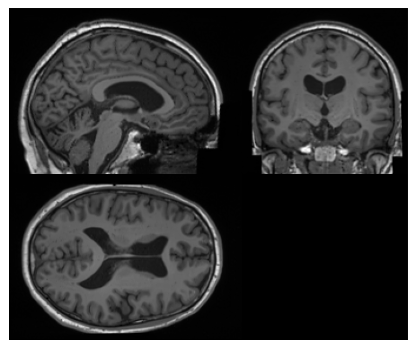

# Brain Imaging Generation with Latent Diffusion Models

### **Authors**

Walter H. L. Pinaya, Petru-Daniel Tudosiu, Jessica Dafflon, Pedro F Da Costa, Virginia Fernandez, Parashkev Nachev,
Sebastien Ourselin, and M. Jorge Cardoso

### **Tags**
Synthetic data, Latent Diffusion Model, Generative model, Brain Imaging

## **Model Description**
This model is trained using the Latent Diffusion Model architecture [1] and is used for the synthesis of conditioned 3D
brain MRI data. The model is divided into two parts: an autoencoder with a KL-regularisation model that compresses data
into a latent space and a diffusion model that learns to generate conditioned synthetic latent representations. This
model is conditioned on age, sex, the volume of ventricular cerebrospinal fluid, and brain volume normalised for head size.

 <br>
<p align="center">
Figure 1 - Synthetic image from the model. </p>


## **Data**
The model was trained on brain data from 31,740 participants from the UK Biobank [2]. We used high-resolution 3D T1w MRI with voxel size of 1mm3, resulting in volumes with 160 x 224 x 160 voxels

#### **Preprocessing**
We used UniRes [3] to perform a rigid body registration to a common MNI space for image pre-processing. The voxel intensity was normalised to be between [0, 1].

## **Performance**
This model achieves the following results on UK Biobank: an FID of 0.0076, an MS-SSIM of 0.6555, and a 4-G-R-SSIM of 0.3883.

Please, check Table 1 of the original paper for more details regarding evaluation results.


## **commands example**
Execute sampling:
```
export PYTHONPATH=$PYTHONPATH:"<path to 'GenerativeModels'>"
$ python -m monai.bundle run save_nii --config_file configs/inference.json --gender 1.0 --age 0.7 --ventricular_vol 0.7 --brain_vol 0.5
```
All conditioning are expected to have values between 0 and 1

## **Citation Info**

```
@inproceedings{pinaya2022brain,
  title={Brain imaging generation with latent diffusion models},
  author={Pinaya, Walter HL and Tudosiu, Petru-Daniel and Dafflon, Jessica and Da Costa, Pedro F and Fernandez, Virginia and Nachev, Parashkev and Ourselin, Sebastien and Cardoso, M Jorge},
  booktitle={MICCAI Workshop on Deep Generative Models},
  pages={117--126},
  year={2022},
  organization={Springer}
}
```

## **References**

Example:

[1] Pinaya, Walter HL, et al. "Brain imaging generation with latent diffusion models." MICCAI Workshop on Deep Generative Models. Springer, Cham, 2022.

[2] Sudlow, Cathie, et al. "UK biobank: an open access resource for identifying the causes of a wide range of complex diseases of middle and old age." PLoS medicine 12.3 (2015): e1001779.

[3] Brudfors, Mikael, et al. "MRI super-resolution using multi-channel total variation." Annual Conference on Medical Image Understanding and Analysis. Springer, Cham, 2018.
